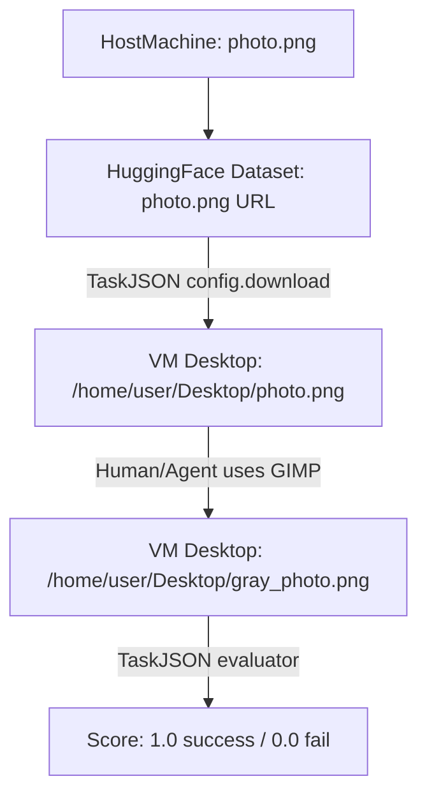

## Phase A — OSWorld Task JSON creation (OSBench / OSWorld-SFT)

This document is **only** about Phase A: creating the **Task JSON** that defines your OSWorld task.

Your assessment task (fixed):
- **snapshot**: `gimp`
- **instruction**: Convert the image `photo.png` to black and white, then export the grayscale image to the Desktop as `gray_photo.png`.

---

## What is the goal of Phase A?

### The goal
Create **one valid OSWorld Task JSON** that:

- **(A) Reproducibly sets up the VM** so the task starts from the same state every time.
- **(B) Tells the agent/human what to do** (the `instruction`).
- **(C) Enables automatic scoring** (the `evaluator`) so the system can decide success/failure without a person guessing.

### What Phase A is NOT
- It is **not** recording actions (that’s later phases using `run_manual.py`).
- It is **not** just writing an instruction in text.
- It is **not** only “making sure the file exists on your computer”.

Phase A is about writing a **machine-readable task blueprint**.

---

## What files go where (the core mental model)

There are three “places” you must keep separate:

1) **Your computer (host machine)**: where you edit JSON and run scripts
2) **Hugging Face (remote storage)**: where you store task input files (and sometimes “golden” expected outputs)
3) **The VM (Ubuntu desktop snapshot)**: where OSWorld runs the task

### The data flow (what OSWorld-SFT will do)



### Why this separation matters
- The VM is isolated: it does **not** automatically see your laptop files.
- OSWorld needs a deterministic way to place `photo.png` into the VM before the task starts.
- That deterministic method is implemented using `config` steps in the Task JSON (especially `download`).

---

## Why the Hugging Face step is necessary (what it is actually for)

The Hugging Face part is not “optional flavor”. It solves a real requirement:

- Your task needs an **input file**: `photo.png`.
- The task runs inside a VM.
- Therefore, you need a **stable URL** that the task runner can download from into the VM.

The guide recommends Hugging Face because:
- Google Drive links can get blocked/rate-limited.
- Hugging Face dataset “resolve/main/…” links are stable and public (required).
- The Task JSON supports a `download` action that takes a URL + destination path inside the VM.

So Hugging Face is how you provide the “initial state file(s)” to the VM reliably.

---

## What you must already have before writing the JSON

Before Phase A, you should have:

- **A local image file** called `photo.png` on your host machine (the one you will upload).
- A **public Hugging Face dataset repo** where you uploaded:
  - at minimum: `photo.png`
  - optionally: a “golden” grayscale output image if you choose an evaluator that compares output to expected.

### What exact URL you need from Hugging Face
For each file you upload, Hugging Face gives you a stable URL of the form:

`https://huggingface.co/datasets/<your-username>/<your-dataset>/resolve/main/<filename>`

Example (template):
- Input file URL:
  - `.../resolve/main/photo.png`

If you also upload a golden expected output:
- Golden output URL:
  - `.../resolve/main/golden_gray_photo.png`

---

## Where will the JSON be stored? (two locations, two reasons)

You will use the **same JSON content** but place it in two places during the workflow:

### 1) Validation location (Phase A check)

- Create a folder named `Deliverable` (at your working root).
- Save the JSON as:
  - `Deliverable/<task_id>.json`

Run validation:

```bash
python Turing_tooling/validation_script.py Deliverable <task_id>
```

If valid, the guide says you should see:
- `✅ JSON structure validation: PASSED`

### 2) Task library location (where OSWorld-SFT expects tasks)

For the actual run/record steps later, the guide expects task JSONs under:

- `evaluation_examples/examples/<domain>/<task_id>.json`

For this task:
- `<domain>` should be `gimp`
- so you typically create:
  - `evaluation_examples/examples/gimp/<task_id>.json`

---

## The OSWorld Task JSON: what must be inside it

OSWorld-SFT validates your JSON against:
- `OSWorld-SFT/osworld_updated_schema.json`

This schema requires these top-level fields (all required):
- `id`
- `snapshot`
- `instruction`
- `source`
- `trajectory`
- `config`
- `related_apps`
- `evaluator`
- `proxy`
- `fixed_ip`
- `possibility_of_env_change`
- `model_pass_rate`
- `annotator_hints`
- `knowledge_points`
- `coverage`

If any are missing, validation fails.

---

## Field-by-field: what to put (tailored to the GIMP grayscale task)

### `id`
- A UUID string (unique per task)
- Must match:
  - the filename `<task_id>.json`
  - the packaging folder name later

Example: `3f6d4a7a-1b2c-4d5e-9f01-23456789abcd`

### `snapshot`
- Must be exactly: `"gimp"`
- This selects the VM snapshot/environment “Ubuntu with GIMP installed”.

### `instruction`
- Must describe what to do.
- For this assessment, use the provided instruction exactly (don’t change meaning):
  - Convert `photo.png` to black and white, export to Desktop as `gray_photo.png`.

### `source`
- A string that says where the task came from.
- Example values:
  - `"OSBench"`
  - `"Turing"`
  - `"custom"`

### `trajectory`
- Usually `"trajectories/"` (as used in the guide).

### `config` (the most important part of Phase A)

`config` is an array of setup actions run *before* the instruction begins.

The schema allows config action types including:
- `download`, `launch`, `activate_window`, `open`, `sleep`, `command`, etc.

For your task, you almost always want:

1) `download` the input file into the VM:
   - From Hugging Face URL
   - To `/home/user/Desktop/photo.png`

2) `launch` GIMP:
   - On Ubuntu snapshots, usually `["gimp"]`

3) `activate_window` (optional but recommended):
   - Focus the GIMP window so your subsequent recorded actions are reliable.
   - `window_name` must match the VM’s window title (you can adjust after seeing it).

### `related_apps`
- List the apps used by this task.
- Use: `["gimp"]`

### `evaluator` (how the system decides success)

The evaluator is required and always contains:
- `func`: the function name used to evaluate
- `result`: what to collect from the VM (file, command output, etc.)
- `expected`: what “correct” looks like (rule, file, etc.)

The schema supports image evaluators including:
- `compare_images`
- `compare_image_list`

For this task, the most objective approach is:

#### Recommended evaluator approach: compare output to a golden expected output
You provide a golden expected grayscale image (hosted as a cloud file), and evaluator compares it with the produced VM file.

This requires you to upload **two files** to Hugging Face:
- `photo.png` (input)
- `golden_gray_photo.png` (expected output)

Then:
- `result` points to: `/home/user/Desktop/gray_photo.png`
- `expected` points to your Hugging Face golden file

Why this is recommended:
- Checking only that `gray_photo.png` exists does not prove it is grayscale or correct.
- Comparing to a golden output is the clearest automated verification.

### `proxy`
- Boolean.
- For a GIMP task, typically `false` (proxy is mainly for browser tasks).

### `fixed_ip`
- Boolean.
- Usually `false` unless a task explicitly needs stable networking.

### `possibility_of_env_change`
- Must be one of: `"low"`, `"medium"`, `"high"`
- For image edit/export: typically `"low"`

### `model_pass_rate`
- The guide instructs including **only** `"claude-4-sonnet-20250514"` with a value between 0 and 1.
- Example:
  - `"model_pass_rate": { "claude-4-sonnet-20250514": 0.8 }`

### `annotator_hints`
- An array of strings that describes the intended steps.
- Example:
  - "Step 1: Launch GIMP"
  - "Step 2: Open photo.png from Desktop"
  - "Step 3: Convert to grayscale"
  - "Step 4: Export to Desktop as gray_photo.png"

### `knowledge_points`
- An array of strings describing skills required.
- Example:
  - "GIMP basic usage"
  - "Grayscale conversion"
  - "Exporting images to Desktop"

### `coverage`
- A short string describing what the task covers.
- Example:
  - "Basic image editing and export in GIMP"

---

## A “Phase A complete” JSON template (fill in placeholders)

Replace placeholders:
- `<task_id>`: your UUID
- `<hf_input_url>`: Hugging Face URL for `photo.png`
- `<hf_golden_url>`: Hugging Face URL for golden grayscale image
- `<window_name>`: whatever the GIMP window title is in the VM (you may adjust later)

```json
{
  "id": "<task_id>",
  "snapshot": "gimp",
  "instruction": "Convert the image photo.png to black and white, then export the grayscale image to the Desktop as gray_photo.png",
  "source": "OSBench",
  "trajectory": "trajectories/",
  "config": [
    {
      "type": "download",
      "parameters": {
        "files": [
          {
            "url": "<hf_input_url>",
            "path": "/home/user/Desktop/photo.png"
          }
        ]
      }
    },
    {
      "type": "launch",
      "parameters": {
        "command": ["gimp"]
      }
    },
    {
      "type": "activate_window",
      "parameters": {
        "window_name": "<window_name>"
      }
    }
  ],
  "related_apps": ["gimp"],
  "evaluator": {
    "func": "compare_images",
    "result": {
      "type": "vm_file",
      "path": "/home/user/Desktop/gray_photo.png"
    },
    "expected": {
      "type": "cloud_file",
      "path": "<hf_golden_url>",
      "dest": "golden_gray_photo.png"
    }
  },
  "proxy": false,
  "fixed_ip": false,
  "possibility_of_env_change": "low",
  "model_pass_rate": {
    "claude-4-sonnet-20250514": 0.8
  },
  "annotator_hints": [
    "Step 1: Launch GIMP",
    "Step 2: Open /home/user/Desktop/photo.png",
    "Step 3: Convert the image to grayscale (black and white)",
    "Step 4: Export the result to the Desktop as gray_photo.png"
  ],
  "knowledge_points": [
    "GIMP basic usage",
    "Grayscale conversion",
    "Export/export-as workflow"
  ],
  "coverage": "Convert an image to grayscale in GIMP and export it"
}
```

---

## Phase A step-by-step checklist (do these in order)

### Step 0: Create task id
- Generate a UUID → this becomes `<task_id>`.

### Step 1: Upload files to Hugging Face (inputs and possibly goldens)
- Upload `photo.png` to your HF dataset repo.
- (Recommended) Create and upload a golden grayscale file (e.g., `golden_gray_photo.png`).
- Copy the `resolve/main/...` URLs for the files.

### Step 2: Create the Task JSON
- Fill in all required fields.
- Ensure:
  - `snapshot` is `gimp`
  - `config` downloads `photo.png` into `/home/user/Desktop/photo.png`
  - evaluator checks `/home/user/Desktop/gray_photo.png`

### Step 3: Save JSON for validation
- Save as: `Deliverable/<task_id>.json`

### Step 4: Validate JSON format
Run:

```bash
python Turing_tooling/validation_script.py Deliverable <task_id>
```

Confirm:
- `✅ JSON structure validation: PASSED`

### Step 5: Save JSON for task execution/recording
- Copy the same JSON into:
  - `evaluation_examples/examples/gimp/<task_id>.json`

This is the path you will point `run_manual.py` at later to record your golden trajectory.

---

## Common mistakes in Phase A (and how to avoid them)

- **Mistake: VM can’t see your file**
  - Fix: ensure `config.download` uses your Hugging Face URL and saves to `/home/user/Desktop/photo.png`.

- **Mistake: Wrong snapshot**
  - Fix: set `"snapshot": "gimp"` exactly.

- **Mistake: Evaluator cannot actually verify grayscale**
  - Fix: use `compare_images` (or `compare_image_list`) against a golden grayscale image.

- **Mistake: JSON fails validation**
  - Fix: ensure all required fields exist, and that `evaluator` contains `func`, `result`, and `expected`.

- **Mistake: wrong file name**
  - Fix: the validation script assumes filename is `<task_id>.json`.

---

## What you “should feel confident about” after Phase A

You should be able to answer these questions:

- Where will `photo.png` be inside the VM when the task starts?
  - `/home/user/Desktop/photo.png`

- Where must the final output be saved in the VM?
  - `/home/user/Desktop/gray_photo.png`

- Why did we use Hugging Face?
  - To reliably move files into the VM using `config.download`.

- What is the Task JSON doing?
  - Defining VM setup + instruction + evaluation so the task is reproducible and scorable.

